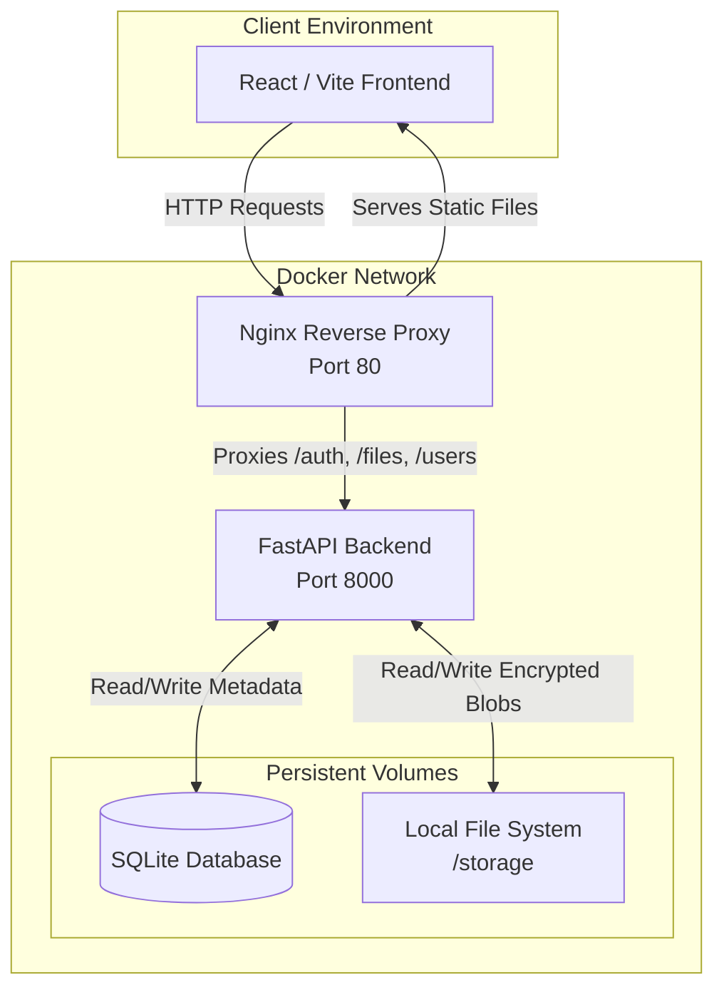
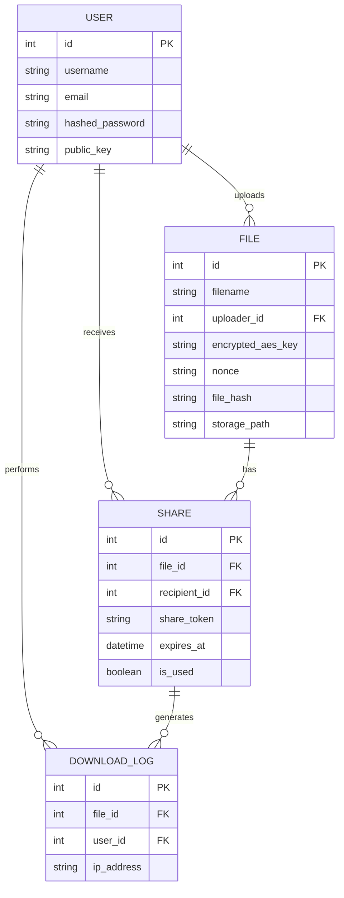

# System Architecture & Design

SecureShare follows a decoupled client-server architecture, containerized via Docker for reliable deployment.

## Architecture Diagram

## Component Breakdown

### 1. Nginx Reverse Proxy
Acting as the frontend container's server, Nginx serves the static compiled React SPA. Crucially, it acts as a reverse proxy for all API calls (e.g., routing `http://localhost/auth/login` directly to the FastAPI container). 
**Design Reasoning**: This completely eliminates Cross-Origin Resource Sharing (CORS) issues in production and removes the need to hardcode API URLs at build-time.

### 2. FastAPI Backend
The core backend handles user authentication, JWT minting, file uploading, and cryptography validation.
**Design Reasoning**: FastAPI was chosen for its asynchronous support (`async def`), out-of-the-box Pydantic validation (which secures endpoints against malformed payloads), and automatic OpenAPI documentation generation.

### 3. Persistent Volumes
To ensure data survives container restarts, Docker volumes are mounted:
- `secureshare.db`: Holds Users, Files, Share links, and Download Logs.
- `storage/`: Holds the physical `.enc` files.
**Design Reasoning**: SQLite was chosen over PostgreSQL specifically for portability, allowing evaluators to run the project entirely locally without needing to configure complex database servers or cloud infrastructure.

## Entity Relationship (ER) Diagram

